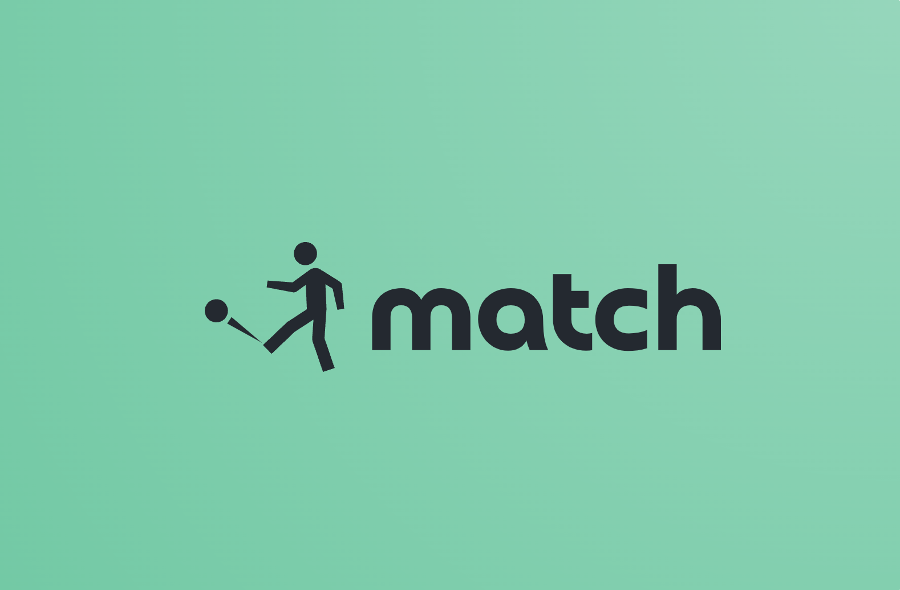

    

# Match

Matcher - a sports management app for teen coding camp participants in Summer Computer School.

# Запуск bff

1. Переключиться на папку `./bff` в терминале
2. Скопировать `.env.example` и переименовать в `.env`
3. Заполнить пустующие поля в `.env`:
   * `TELEGRAM_TOKEN` - токен телеграм-бота
4. Ввести: `make up` или `make start`
5. Для завершения работы докера ввести: `make down` или `make stop`